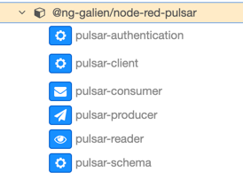
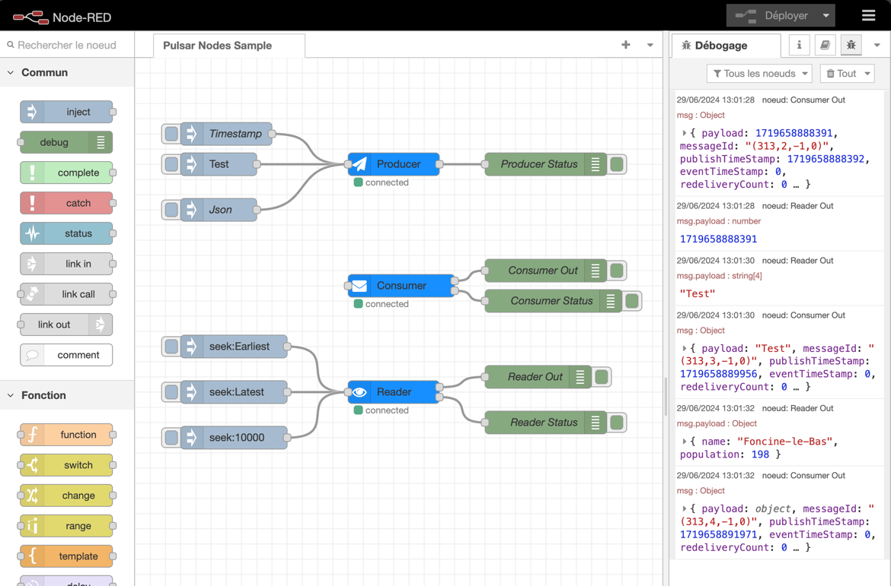

# node-red-contrib-pulsar

Add Apache Pulsar support to Node-RED.  

This package provides a set of nodes that allow you to send and receive messages from Apache Pulsar in your Node-RED flow.

## Features

- **Pulsar Producer**: Send messages to a Pulsar topic.
- **Pulsar Consumer**: Receive messages from a Pulsar topic.
- **Pulsar Reader**: Read messages from a Pulsar topic.

These nodes use some configuration nodes:

- **Pulsar Client**: Configure the connection settings for the Pulsar client.
- **Pulsar Authentication**: Configure the authentication settings for the Pulsar client.
- **Pulsar Schema**: Configure the schema settings for producing and consuming messages.



These nodes are based on the [Pulsar Node.js client](https://github.com/apache/pulsar-client-node).

## Install

> Run the following command in your Node-RED user directory - typically `~/.node-red`

```bash
npm i @ng-galien/node-red-pulsar
```

## Example Flow

A [sample](examples/pulsar-nodes.json) flow is provided in the `example` directory. You can import it into your Node-RED instance.



